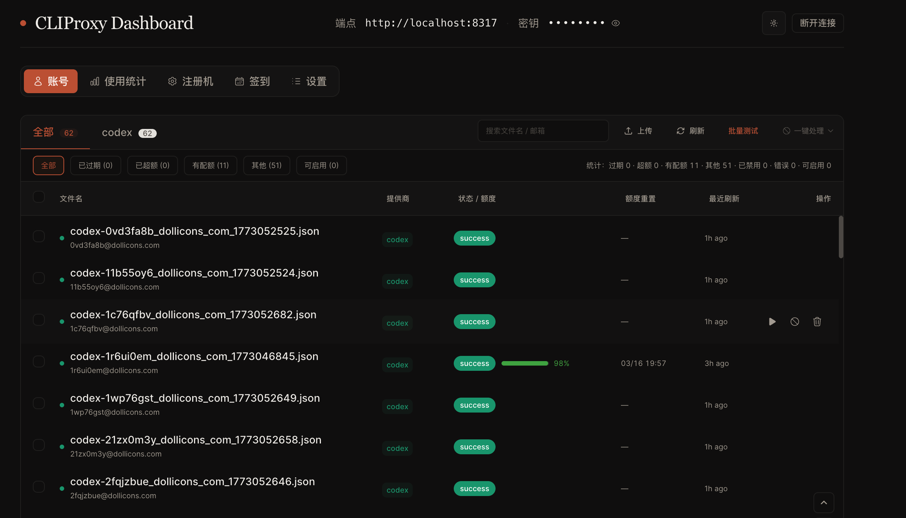
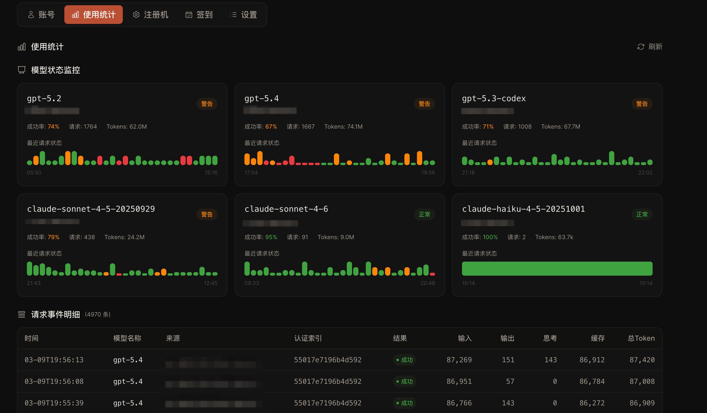
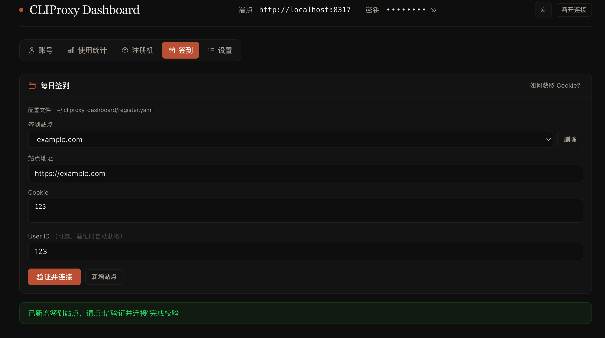
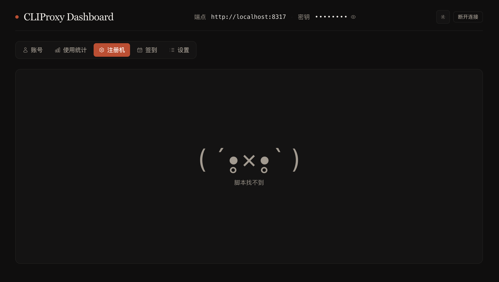

# codex-detect

[中文](./README_zh.md) | English

CLIProxyAPI auth dashboard.

## Features

- Provider tabs with quick status filters for large credential sets
- Virtualized credential table for smooth 1k+ row rendering
- Column-header sorting (click to toggle asc/desc)
  - File name
  - Status / quota
  - Quota reset time
  - Last refresh time
- Batch test and bulk enable/disable/delete actions
- Credential upload modal
  - Drag & drop or file picker
  - Concurrent upload with configurable pool size (1 / 2 / 3 / 5 / 10)
  - Progress display (done/total, active uploads)
  - One-click retry for failed uploads
- Test result persistence across page refresh
  - Toggling enable/disable no longer clears existing test results

## Screenshots

### Dashboard


### Usage Monitoring


### Daily Check-in


### Registration Scripts


## Development

```bash
pnpm install
pnpm dev
```

Optional local dev proxy (Vite only):

```bash
VITE_PROXY_MODE=true VITE_ENDPOINT=http://localhost:8317 pnpm dev
```

## Build

```bash
pnpm build
```

## Management API Notes

- Base path: `/v0/management`
- Auth files list: `GET /auth-files`
- Auth files upload (multipart): `POST /auth-files`
  - Multipart field name must be `file` (single file per request)

When `VITE_PROXY_MODE=true`, frontend `/api/management/*` requests are proxied to
`<VITE_ENDPOINT>/v0/management/*` by Vite dev server.

## Cloudflare Pages Deployment

- Framework preset: `None`
- Build command: `pnpm build`
- Build output directory: `dist`

`useProxy` is only for local Vite development. In Cloudflare Pages production, Vite proxy is not active.

For production API access, choose one:

1. Target endpoint supports CORS for your Pages domain
2. Configure a same-origin reverse proxy on Cloudflare side
